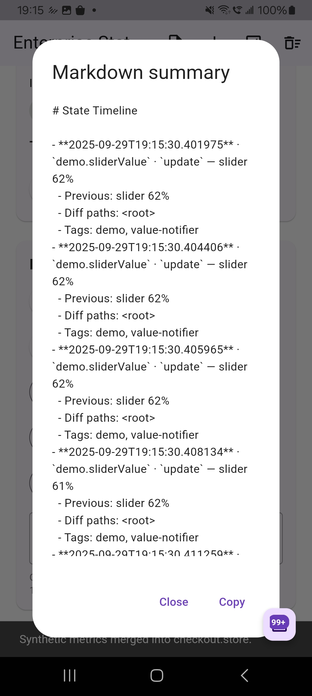
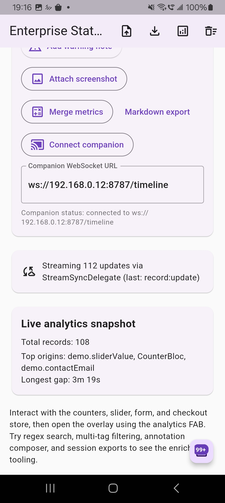
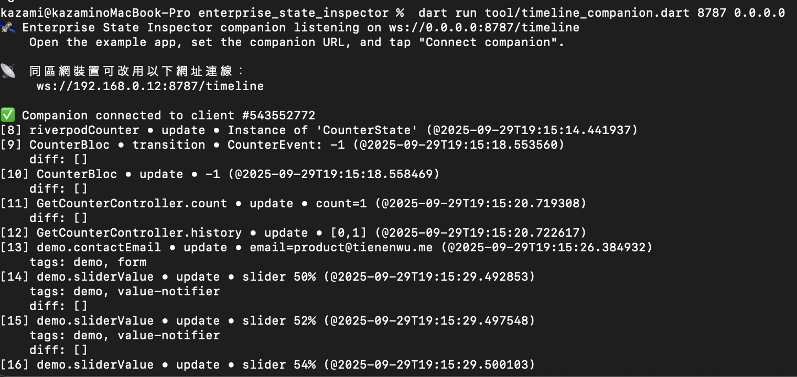

# Enterprise State Inspector

Enterprise-grade runtime insight for your Flutter state management layers. This
package captures Riverpod and Bloc state transitions, stores them in an
inspectable timeline, and ships with a Material overlay so teams can debug
complex flows without leaving the app.

## Quick start

1. **Install & wire observers**
   ```dart
   final inspector = StateInspectorController.instance;
   Bloc.observer = StateInspectorBlocObserver(controller: inspector);

   runApp(
     ProviderScope(
       observers: [StateInspectorRiverpodObserver(controller: inspector)],
       child: MyBootstrap(inspector: inspector),
     ),
   );
   ```

2. **Wrap your `MaterialApp`/`GetMaterialApp`** – use the `builder` parameter so
   the overlay inherits your app’s `Navigator`, `Overlay`, and `Directionality`:
   ```dart
   class MyBootstrap extends StatelessWidget {
     const MyBootstrap({super.key, required this.inspector});
     final StateInspectorController inspector;

     @override
     Widget build(BuildContext context) {
       return MaterialApp(
         builder: (context, child) => StateInspectorOverlay(
           controller: inspector,
           child: child ?? const SizedBox.shrink(),
         ),
         home: const HomePage(),
       );
     }
   }
   ```

3. **Toggle the floating action button** to reveal the timeline; search, pin,
   pause, or export events directly from the overlay.

## Features

- First-class observers for Riverpod, Bloc/Cubit, and GetX so popular state managers
  stream straight into the timeline with diffs, metadata, and error capture.
- Unified adapter primitives (`StateInspectorAdapters`) for `ValueListenable`,
  `Listenable`, and stream-driven architectures—plug in MobX, Redux, ChangeNotifier,
  or your homegrown layer without new package dependencies.
- A draggable overlay with pause/resume, pinning, diff visualisation, and rich search
  controls (regex, case-sensitive, multi-tag, severity, and time-range filters).
- Built-in analytics that surface top talkative origins, longest gaps between events,
  and per-kind counts so large timelines stay actionable.
- Inline annotation composer to tag, prioritise, and comment on events; attach
  screenshots/logs, merge metrics, and keep everything alongside the captured state.
- Multiple export formats: JSON (raw/session), Markdown summaries, and CLI-friendly
  tables ready to paste into tickets or chat threads.
- Live streaming hooks (`StateInspectorSyncDelegate`/`StreamSyncDelegate`) for mirroring
  timelines to desktop/web companions over WebSocket or HTTP bridges.
- Adapter registry + helpers (`observeStream`, `observeNotifier`) so third-party state
  managers can auto-register adapters without core changes.
- Analytics stream (`controller.analyticsStream`) and broadcast event bus for powering
  custom dashboards or multi-client companions.
- Comes with a fully wired example demo plus production-ready overlay theming that
  respects your app’s navigator, overlay, and directionality.

## Screenshots & demo


*Floating inspector pinned to the right, streaming Riverpod & Bloc updates while the app stays interactive.*


*Detail panel highlighting structured diffs, previous/current JSON snapshots, and metadata for a selected event.*


*Timeline search, event-kind filters, and a GetX counter emitting into the same session.*


*Animated tour showing pausing capture, pinning events, exporting sessions, and navigating diffs.*


*Detail panel showing how attachments appear alongside a captured event, including description and capture timestamp.*


*Pinned event carrying two related screenshots so investigators can jump straight to the visual evidence.*


*Demo controls that add placeholder screenshots during a session, illustrating how to bind your own capture workflow.*

### Example highlights

- Riverpod, Bloc, and GetX counters emit rich diffs and metadata into the same timeline.
- ValueListenable + ChangeNotifier adapters capture a slider, form field, and checkout cart without bespoke observers.
- Buttons in the demo add annotations, merge synthetic metrics, attach placeholder screenshots, and stream events to a console sink via `StreamSyncDelegate`.

### CLI companion

1. Start the companion listener（重要：若只執行 `dart run tool/timeline_companion.dart` 會僅綁定在 127.0.0.1，實體裝置或同區網的機器將無法連線）：
   ```sh
   # 只給本機端
   dart run tool/timeline_companion.dart 8787

   # 或綁定所有介面，讓同區網裝置可連線
   dart run tool/timeline_companion.dart 8787 0.0.0.0
   ```
2. Run the example app, scroll to **Inspector extras**, adjust the WebSocket URL if needed
   (for emulators use your host IP), and tap **Connect companion**.
3. 伴侶會列出本機 loopback 以及偵測到的區網 IPv4；若使用實體裝置，改用該 IPv4 即可連線。
4. Timeline 事件與統計會即時輸出在終端，方便驗證遠端 DevTools 是否正常接收。

## Getting started

1. **Install the package**

   ```yaml
   dependencies:
     enterprise_state_inspector: ^0.1.3
   ```

2. **Wire the observers** into your application bootstrap:

   ```dart
   final inspector = StateInspectorController.instance;
   Bloc.observer = StateInspectorBlocObserver(controller: inspector);

   runApp(
     ProviderScope(
       observers: [StateInspectorRiverpodObserver(controller: inspector)],
       child: StateInspectorOverlay(
         controller: inspector,
         child: MyApp(),
       ),
     ),
   );
   ```

3. **Embed the overlay via your app’s builder** so the inspector sits alongside
   your existing `Navigator`/`Overlay` stack.

## Usage

- **Riverpod integration**: add `StateInspectorRiverpodObserver` to the
  `ProviderScope.observers` list. Each provider emit/refresh shows up in the
  timeline with previous and next values.
- **Bloc integration**: assign `Bloc.observer` to an instance of
  `StateInspectorBlocObserver`. Cubit `onChange` and Bloc `onTransition`
  callbacks automatically forward events to the inspector.
- **GetX integration**: call `StateInspectorGetAdapter.observeRx` (or the list/
  map helpers) on the `Rx` values you care about—dispose the returned `Worker`
  in `onClose`. Initial values and subsequent updates land in the same
  timeline with diffs.
- **Adapters for other managers**: use `StateInspectorAdapters.observeValueListenable`
  for `ValueNotifier`/`TextEditingController`, `observeListenable` for
  `ChangeNotifier`/MobX stores, or wrap Redux stores by piping their change
  stream into `controller.capture`.
- **Adapter registry**: 呼叫 `StateInspectorAdapterRegistry.register`/`install`
  讓第三方 state manager 的 adapter 可以動態掛載；同時提供 `observeStream`、
  `observeNotifier` 等 helper 簡化實作。
- **Overlay controls**: tap the floating analytics FAB (or call
  `inspector.togglePanel()`) to open/close the panel. Drive filters with event-kind
  chips, regex/case-sensitive search, tag selections, severity toggles, and
  time-range presets. Pause/resume capture, pin key events, and reset quickly.
- **Annotations & attachments**: add inline notes with severity/tags, attach
  screenshots or log files, and delete them once resolved. Tags automatically
  feed the global filter sidebar. Screenshot attachments (`Add placeholder screenshot`
  action in the example) show up with descriptions and timestamps so the team
  knows exactly which visual evidence belongs to each state change.
- **Diff viewer**: structured states (maps, lists, JSON-like objects) are normalised and
  diffed automatically. Inspect path-by-path changes in the detail panel without leaving
  the running app.
- **Export & automation**: generate JSON, Markdown summaries, or CLI tables with
  `exportAsJson`, `exportAsMarkdown`, or `exportAsCliTable`. Use
  `exportSessionJson()`/`importSessionJson()` for full history restores.
- **Live sync**: register a `StateInspectorSyncDelegate` (例如 `StreamSyncDelegate`
  或新的 `WebSocketSyncDelegate`) 將事件推送到桌面/瀏覽器工具；`StateTimelineEventBus`
  可作為統一的事件匯流排，廣播給多個 listener 或自訂儀表板。

Minimal Riverpod + Bloc sample (see `/example` for the full demo):

```dart
final counterProvider =
    StateNotifierProvider<CounterNotifier, int>((ref) => CounterNotifier());

class CounterNotifier extends StateNotifier<int> {
  CounterNotifier() : super(0);
  void increment() => state++;
}

class CounterBloc extends Bloc<CounterEvent, int> {
  CounterBloc() : super(0) {
    on<CounterEvent>((event, emit) => emit(state + 1));
  }
}
```

```dart
class AppBootstrap extends StatelessWidget {
  AppBootstrap({super.key}) : controller = StateInspectorController.instance;

  final StateInspectorController controller;

  @override
  Widget build(BuildContext context) {
    Bloc.observer = StateInspectorBlocObserver(controller: controller);
    return ProviderScope(
      observers: [StateInspectorRiverpodObserver(controller: controller)],
      child: StateInspectorOverlay(
        controller: controller,
        child: const MyApp(),
      ),
    );
  }
}
```

### Advanced APIs

- Access individual timeline entries (`StateChangeRecord`) via `controller.records` to build custom tooling. Records now carry tags, metrics, annotations, attachments, and structured diffs for richer analytics.
- Query aggregate insights through `controller.analytics` (`StateTimelineAnalytics`) to surface hot origins, average/longest gaps, and per-kind counts.
- Subscribe to `controller.analyticsStream` 或使用 `StateTimelineEventBus` 取得即時事件
  與統計，方便串接自訂 DevTools/儀表板。
- Manage metadata at runtime with `addAnnotation`, `removeAnnotation`, `addTags`, `mergeMetrics`, `addAttachment`, and `removeAttachment` to keep the timeline curated.
- Subscribe to the live `controller.recordStream` or register a `StateInspectorSyncDelegate` to mirror events to remote tooling.
- Export and rehydrate sessions with `exportSessionJson`/`importSessionJson`, or generate Markdown/CLI reports with `exportAsMarkdown` and `exportAsCliTable` for status updates.
- Author your own adapters—either with `StateInspectorAdapters` helpers or by normalising state and calling `controller.capture(...)` directly when you need custom diff strategies.

```dart
class MyGetxController extends GetxController {
  final RxInt count = 0.obs;
  late final Worker _countWorker;

  @override
  void onInit() {
    super.onInit();
    _countWorker = StateInspectorGetAdapter.observeRx<int>(
      count,
      origin: 'myController.count',
    );
  }

  @override
  void onClose() {
    _countWorker.dispose();
    super.onClose();
  }
}

// ValueListenable / ChangeNotifier / MobX style
final textController = TextEditingController();
final disposer = StateInspectorAdapters.observeValueListenable(
  textController,
  origin: 'loginForm.email',
);

// Later, dispose the observer (e.g. in State.dispose)
disposer.dispose();

// ChangeNotifier / MobX / Redux stores
final handle = StateInspectorAdapters.observeListenable(
  store,
  origin: 'cartStore',
  stateResolver: () => store.snapshot(),
);
```

## Example demo


*Floating inspector pinned to the right, streaming Riverpod & Bloc updates while the app stays interactive.*


*Detail panel highlighting structured diffs, previous/current JSON snapshots, and metadata for a selected event.*


*Timeline search, event-kind filters, and a GetX counter emitting into the same session.*


*Animation: opening the overlay, pausing capture, pinning events, exporting sessions, and navigating diffs.*

## Support & feedback

Issues and feature requests are welcome on the
[GitHub tracker](https://github.com/tienenwu/enterprise_state_inspector/issues).
Pull requests for additional adapters (e.g. MobX, GetX) are encouraged.
