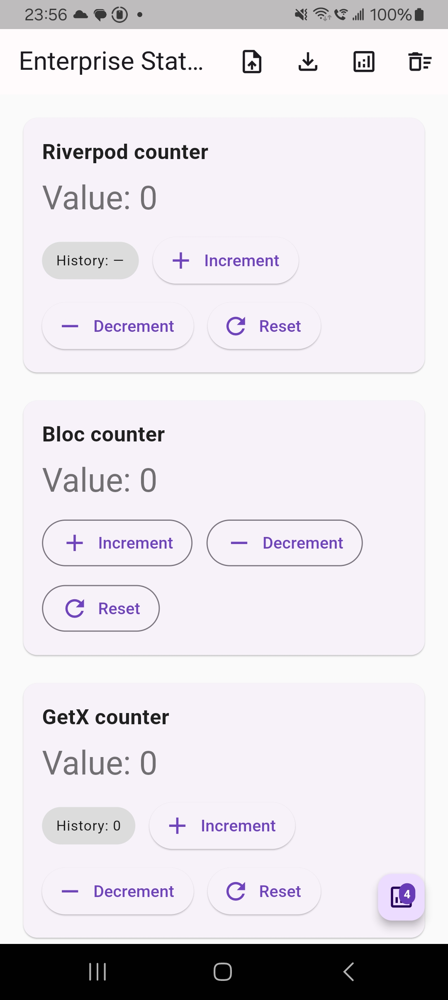
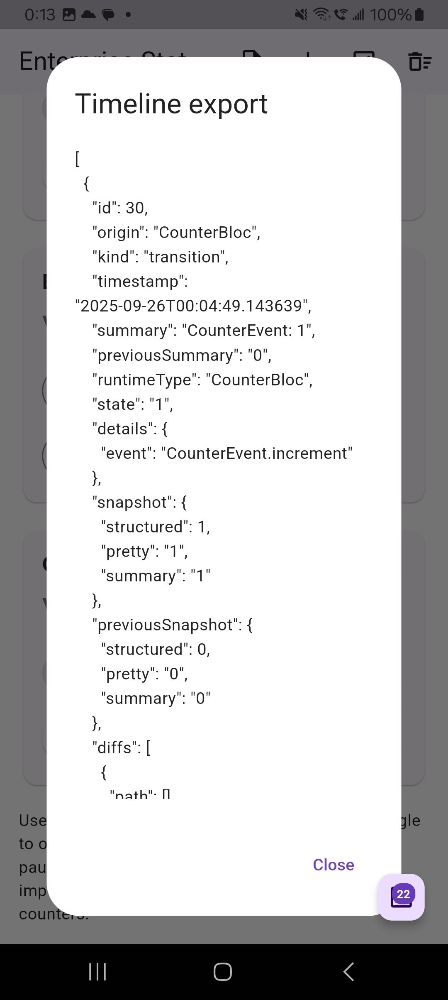
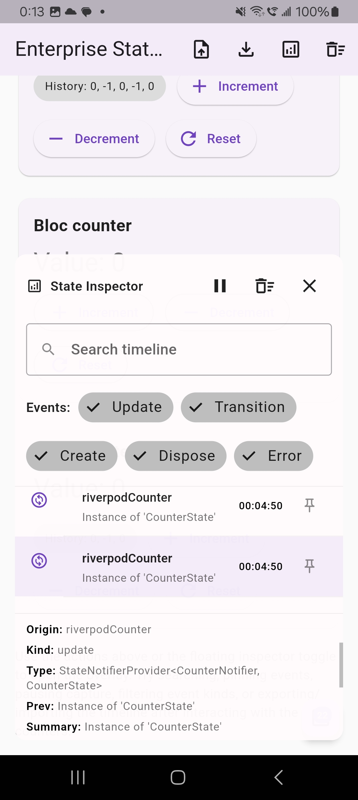

# Enterprise State Inspector

Enterprise-grade runtime insight for your Flutter state management layers. This
package captures Riverpod and Bloc state transitions, stores them in an
inspectable timeline, and ships with a Material overlay so teams can debug
complex flows without leaving the app.

## Quick start

1. **Install & wire observers**
   ```dart
   final inspector = StateInspectorController.instance;
   Bloc.observer = StateInspectorBlocObserver(controller: inspector);

   runApp(
     ProviderScope(
       observers: [StateInspectorRiverpodObserver(controller: inspector)],
       child: MyBootstrap(inspector: inspector),
     ),
   );
   ```

2. **Wrap your `MaterialApp`/`GetMaterialApp`** – use the `builder` parameter so
   the overlay inherits your app’s `Navigator`, `Overlay`, and `Directionality`:
   ```dart
   class MyBootstrap extends StatelessWidget {
     const MyBootstrap({super.key, required this.inspector});
     final StateInspectorController inspector;

     @override
     Widget build(BuildContext context) {
       return MaterialApp(
         builder: (context, child) => StateInspectorOverlay(
           controller: inspector,
           child: child ?? const SizedBox.shrink(),
         ),
         home: const HomePage(),
       );
     }
   }
   ```

3. **Toggle the floating action button** to reveal the timeline; search, pin,
   pause, or export events directly from the overlay.

## Features

- Records Riverpod `ProviderObserver` events (add/update/dispose/error) with
  timestamps and previous values.
- Hooks into Bloc/Cubit lifecycles via `BlocObserver`, capturing changes,
  transitions, and errors.
- Observes GetX `Rx` types with one-liner helpers so reactive streams feed the
  same timeline (lists/maps included).
- Ships with a draggable overlay panel featuring pause/resume, event-kind filters,
  search, pinning, diff visualisation, and clear/reset controls.
- Computes structured diffs for map/list states so you can inspect granular changes
  without leaving the app.
- Offers JSON export helpers (`controller.exportAsJson`) plus full session snapshots
  (`controller.exportSessionJson`) so teams can attach timelines to bug reports or
  share snapshots.
- Exposes an opt-in singleton controller or instantiable controller for custom
  DevTools integrations.
- Includes a fully wired example app demonstrating Riverpod + Bloc usage.

## Screenshots & demo


*Floating inspector pinned to the right, streaming Riverpod & Bloc updates while the app stays interactive.*


*Detail panel highlighting structured diffs, previous/current JSON snapshots, and metadata for a selected event.*


*Timeline search, event-kind filters, and a GetX counter emitting into the same session.*


*Animated tour showing pausing capture, pinning events, exporting sessions, and navigating diffs.*

## Getting started

1. **Install the package**

   ```yaml
   dependencies:
     enterprise_state_inspector: ^0.1.0-dev.1
   ```

2. **Wire the observers** into your application bootstrap:

   ```dart
   final inspector = StateInspectorController.instance;
   Bloc.observer = StateInspectorBlocObserver(controller: inspector);

   runApp(
     ProviderScope(
       observers: [StateInspectorRiverpodObserver(controller: inspector)],
       child: StateInspectorOverlay(
         controller: inspector,
         child: MyApp(),
       ),
     ),
   );
   ```

3. **Embed the overlay via your app’s builder** so the inspector sits alongside
   your existing `Navigator`/`Overlay` stack.

## Usage

- **Riverpod integration**: add `StateInspectorRiverpodObserver` to the
  `ProviderScope.observers` list. Each provider emit/refresh shows up in the
  timeline with previous and next values.
- **Bloc integration**: assign `Bloc.observer` to an instance of
  `StateInspectorBlocObserver`. Cubit `onChange` and Bloc `onTransition`
  callbacks automatically forward events to the inspector.
- **GetX integration**: call `StateInspectorGetAdapter.observeRx` (or the list/
  map helpers) on the `Rx` values you care about—dispose the returned `Worker`
  in `onClose`. Initial values and subsequent updates land in the same
  timeline with diffs.
- **Overlay controls**: tap the floating analytics FAB (or call
  `inspector.togglePanel()`) to open/close the panel. Pause/resume capture from the
  header, toggle event-kind chips to focus on specific signals, search across events,
  and pin important frames so they stay at the top of the list. Use the actions to
  clear, export, or import sessions.
- **Diff viewer**: structured states (maps, lists, JSON-like objects) are normalised and
  diffed automatically. Inspect path-by-path changes in the detail panel without leaving
  the running app.
- **Export & import programmatically**: call `controller.exportAsJson(pretty: true)` for raw
  timelines, or `controller.exportSessionJson()`/`controller.importSessionJson()` to move full
  sessions (including pinned events) between devices or attach them to bug reports.

Minimal Riverpod + Bloc sample (see `/example` for the full demo):

```dart
final counterProvider =
    StateNotifierProvider<CounterNotifier, int>((ref) => CounterNotifier());

class CounterNotifier extends StateNotifier<int> {
  CounterNotifier() : super(0);
  void increment() => state++;
}

class CounterBloc extends Bloc<CounterEvent, int> {
  CounterBloc() : super(0) {
    on<CounterEvent>((event, emit) => emit(state + 1));
  }
}
```

```dart
class AppBootstrap extends StatelessWidget {
  AppBootstrap({super.key}) : controller = StateInspectorController.instance;

  final StateInspectorController controller;

  @override
  Widget build(BuildContext context) {
    Bloc.observer = StateInspectorBlocObserver(controller: controller);
    return ProviderScope(
      observers: [StateInspectorRiverpodObserver(controller: controller)],
      child: StateInspectorOverlay(
        controller: controller,
        child: const MyApp(),
      ),
    );
  }
}
```

### Advanced APIs

- Access individual timeline entries (`StateChangeRecord`) via `controller.records` to build custom tooling. Each record now includes `StateSnapshot` objects (`snapshot`/`previousSnapshot`) and a list of `StateDiffEntry` values describing structural changes.
- Call `controller.exportSessionJson()` / `controller.importSessionJson()` to serialise and restore entire sessions (including pinned rows) for bug reports or cross-device debugging.
- Author your own adapters by normalising state and passing snapshots directly to `controller.capture(snapshot: ...)` when you need custom diff strategies.

```dart
class MyGetxController extends GetxController {
  final RxInt count = 0.obs;
  late final Worker _countWorker;

  @override
  void onInit() {
    super.onInit();
    _countWorker = StateInspectorGetAdapter.observeRx<int>(
      count,
      origin: 'myController.count',
    );
  }

  @override
  void onClose() {
    _countWorker.dispose();
    super.onClose();
  }
}
```

## Example demo


*Floating inspector pinned to the right, streaming Riverpod & Bloc updates while the app stays interactive.*


*Detail panel highlighting structured diffs, previous/current JSON snapshots, and metadata for a selected event.*


*Timeline search, event-kind filters, and a GetX counter emitting into the same session.*


*Animation: opening the overlay, pausing capture, pinning events, exporting sessions, and navigating diffs.*

## Support & feedback

Issues and feature requests are welcome on the
[GitHub tracker](https://github.com/tienenwu/enterprise_state_inspector/issues).
Pull requests for additional adapters (e.g. MobX, GetX) are encouraged.
